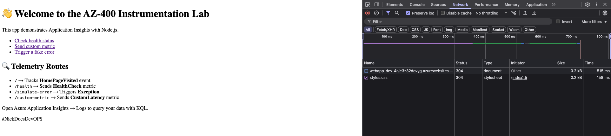
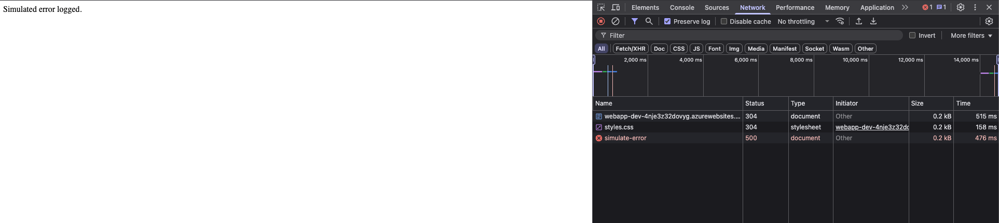
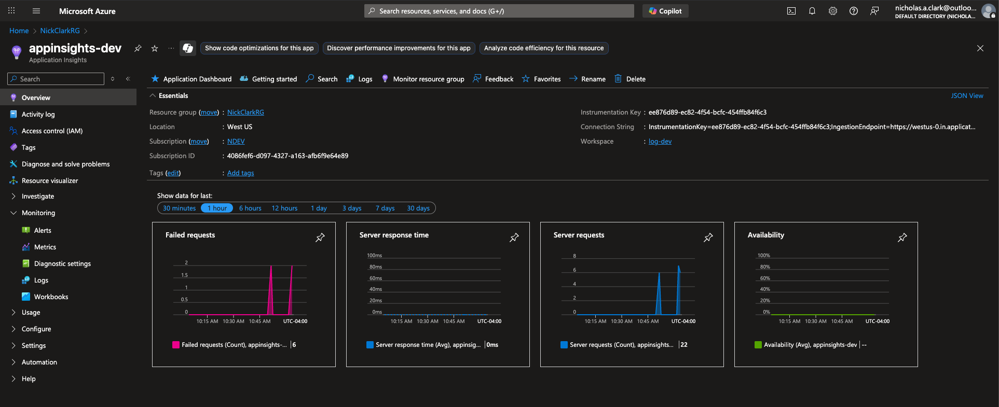
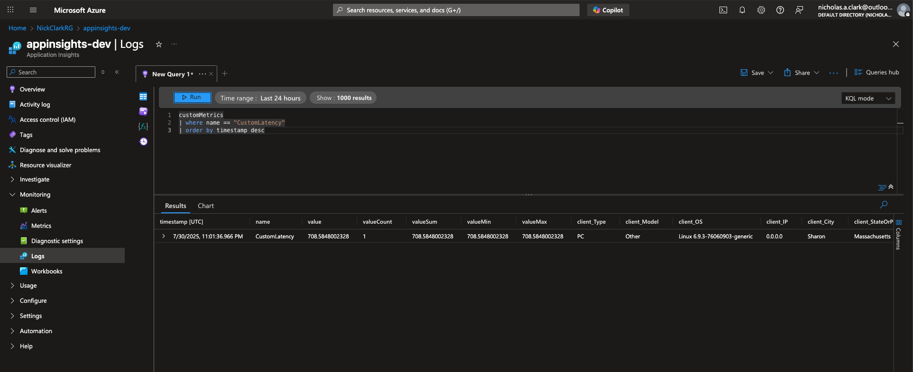

# AZ-400 Instrumentation Lab

## 📝 Description

Brief description of what this project does and who it's for.

## 📸 Screenshots

### Home Page


### Simulated Error Logged


### Application Insights Metrics


### KQL Query


## 🧪 GitHub Actions CI/CD

This repo includes a GitHub Actions workflow that deploys the entire solution—infra and app—with a single click 🚀.

📂 Workflow File:

```bash 
.github/workflows/deploy-lab5.yml
```

📌 What it does:

- Deploys Log Analytics + Application Insights using Bicep
- Deploys Azure Web App and links it to App Insights
- Builds and deploys the Node.js monitoring demo app

🟢 Trigger manually via GitHub UI → Actions → “Deploy Lab 5 - Instrumentation Lab”

## 🚀 Getting Started

### 📦 Prerequisites
- Azure CLI installed and logged in
- Node.js v18+ installed
- Azure subscription

---

### 🔧 Deploy Infrastructure
Run the following to deploy App Insights and Log Analytics workspace:

```bash
az deployment group create \
  --resource-group <your-rg> \
  --template-file infra/main.bicep \
  --parameters location=<azure-region> environment=dev
```

Note the outputs: `appInsightsInstrumentationKey` and `logAnalyticsWorkspaceId`.

### 💻 Run the App Locally

```bash
cd app
cp .env.example .env
# Paste your APPINSIGHTS_INSTRUMENTATIONKEY from deployment output into .env
npm install
npm start
```

Then visit:
- `http://localhost:3000/` – homepage
- `/health` – uptime and system info
- `/simulate-error` – triggers an exception
- `/custom-metric` – sends random latency metric

---

## 📊 Queries
KQL examples are available in `/queries/`:
- homepage-requests.kql – homepage traffic
- errors.kql – application exceptions
- health-checks.kql – system uptime checks

---

## 📁 Project Structure
```
.
├── .gitignore
├── app
│   ├── .env
│   ├── index.js
│   ├── package-lock.json
│   ├── package.json
│   ├── public
│   │   └── styles.css
│   └── views
│       └── index.html
├── bicep
│   ├── main.bicep
│   ├── modules
│   │   ├── app-insights.bicep
│   │   ├── log-analytics.bicep
│   │   └── webapp.bicep
│   └── parameters.dev.json
├── deploy-output.json
├── docs
│   ├── .DS_Store
│   └── screenshots
│       ├── .DS_Store
│       ├── app-insights-metrics.png
│       ├── home-page.png
│       ├── kql-query.png
│       └── simulate-error.png
├── package-lock.json
├── queries
│   ├── errors.kql
│   ├── health-checks.kql
│   └── homepage-requests.kql
├── README.md
├── scripts
│   ├── cleanup.sh
│   └── deploy.sh
```

---

## 🔧 Tools Used
- Azure Bicep
- Application Insights
- Log Analytics
- GitHub Actions
- Node.js + Express

---

## 🦝 Built by NickDoesDevOps

Created with ☕, curiosity, and a touch of chaos by [Nicholas Clark](https://www.linkedin.com/in/nickdoesdevops).  
Follow the journey → [GitHub](https://github.com/NickTheDevOpsGuy) • [LinkedIn](https://www.linkedin.com/in/nickdoesdevops)

🏷 #NickDoesDevOps • #LearningInPublic • #BuiltInPublic